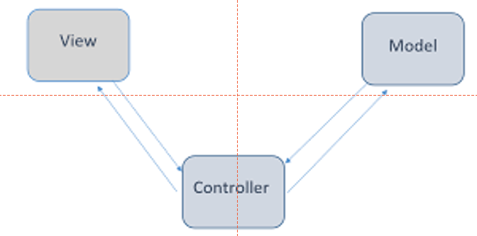
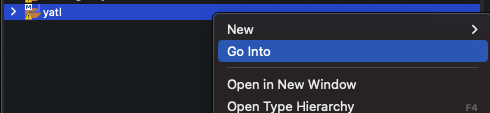
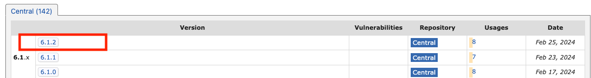
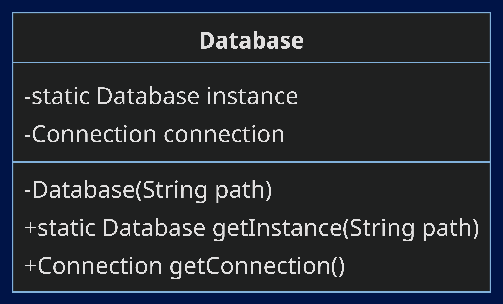

# Yet Another Todo List (YATL) - Part 1


This lab is part one of a two-part case-study. In this first lab, we will create an API for a to-do list in Java. We will use Javalin, a lightweight web framework and SQLite, a simple SQL database engine. We will structure the project using the Model View Controller (MVC) pattern. Furthermore, we will use the Data Access Object (DAO) pattern to interact with the database.

## Learning Objectives

- Create a simple API in Java
- Use SQLite to store data
- Using Maven to manage dependencies
- Understanding the Maven project structure
- Understand the Model View Controller (MVC) architectural pattern
- Understand the DAO pattern to manage database connections

## The Design

### The Database Schema

We are going to keep things simple. We will have a single table in our database.

The schema is as follows:

| column | type    | description                          |
| ------ | ------- | ------------------------------------ |
| id     | INTEGER | Primary key                          |
| title  | TEXT    | The title of the todo item           |
| done   | BOOLEAN | Whether the todo item is done or not |

Example data:

| id  | title           | done  |
| --- | --------------- | ----- |
| 1   | Buy groceries   | false |
| 2   | Do laundry      | true  |
| 3   | Clean the house | false |
| 4   | Mow the lawn    | false |

### The API

A RESTFUL API is an API that follows the principles of REST. REST stands for Representational State Transfer. It is an architectural style for designing networked applications. The idea is that rather than using complex inter-application communication mechanisms, we can use simple HTTP requests.

In our case, we will return JSON from our API. JSON is a lightweight data interchange format. It is easy for humans to read and write. Furthermore, it is easy for machines to parse and generate. Later, a front-end application could consume this API and display the data in a user-friendly way (e.g., a mobile app or a web app).

The JSON format for a todo item is as follows:

```json
{
  "id": 1,
  "title": "Buy groceries",
  "done": false
}
```

A list of todos is represented as an array of todo items:

```json
[
  {
    "id": 1,
    "title": "Buy groceries",
    "done": false
  },
  {
    "id": 2,
    "title": "Do laundry",
    "done": true
  }
]
```

### The Software Architecture



We will use the Model View Controller (MVC) pattern to structure our application. The MVC pattern is a way of separating concerns in an application. It is a way of organising the code so that it is easier to understand and maintain.

## Exercise 1: Setting up the project and our development environment

Let's create a blank Maven project. We will use Maven to manage our dependencies.

1. Open Eclipse (There are two versions on the lab machines. Open the latest version, 2023 to 06)


2. Launch your workspace
3. Click on `File` -> `New` -> `Maven Project`
4. Select `Create a simple project (skip archetype selection)` and click `Next`

::: tip Concept
An archetype is a Maven project template. We can use an archetype to generate a common starting point for our project. In this case, we are creating a simple project from scratch; therefore, we will skip the archetype selection.
:::

5. Fill in the `Group Id` and `Artifact Id` fields. In this case, we will use `com.yatl` as the `Group Id` and `yatl` as the `Artifact Id`. Next, click `Finish`.

::: tip Concept
The `Group Id` is a unique identifier for the project. It is usually the reverse of your domain name. The `Artifact Id` is the name of the project. It is the name of the directory that the project will be created in.
:::

6. You should now see a new project in the `Project Explorer` view. Right-click on the project and click `go into` to focus on the project (this is optional).



Currently, the project is empty. It's organised into the standard Maven project structure. We will add our main project code to the `src/main/java` directory. We will add our tests to the `src/test/java` directory. We will add our resources to the `src/main/resources` directory.
For more information, check out the [Maven Standard Directory Layout](https://maven.apache.org/guides/introduction/introduction-to-the-standard-directory-layout.html) for more information.

7. The first thing we need to do is ensure we are using Java 17. In your package explorer in the root of your project, you should see a file called `JRE System Library`. Right click on this and select `Properties`. In the `Execution Environment` section, select `JavaSE-17` and click `Apply and Close`.


### 1.1 Add Javelin and SQLite dependencies

We will use Javalin to create a web server and SQLite to store our data. We will add these dependencies to our `pom.xml` file. The `pom.xml` file is the configuration file for Maven projects. It contains information about the project and configuration details used by Maven to build the project.

1. Open the `pom.xml` file found in the root of the project
2. Create a new `<dependencies>` tag under above the `</project>` tag

```xml
<dependencies>

</dependencies>
```

XML tags are case-sensitive. Make sure to use the correct case when adding the tags. Moreover, XML tags must be properly nested. For example, the `<dependencies>` tag must be inside the `<project>` tag.

We now need to locate the dependencies for Javalin and SQLite. We can find these on the [Maven Repository](https://mvnrepository.com/). Let's see though, if we can find the dependencies for Javalin and SQLite on the Maven Repository.

3. Open a web browser and navigate to the [Maven Repository](https://mvnrepository.com/)
4. In the search bar, type `javalin` and run the search
5. The top result should be `Javalin`. Click on it to view the details. The group id should be `io.javalin`. Recall this is often the reverse of the domain name. Visit the [Javalin website](https://javalin.io/) to confirm this is the case.
6. Back on the search results, click on the latest version of Javalin 6.1.2 at the time of writing.



7. Repeat the process for SQLite. You should find the group id is `org.xerial` and the artifact id is `sqlite-jdbc`. The latest version at the time of writing is 3.45.1.0.

8. Eclipse normally automatically pulls in the dependencies. You should see a folder called `Maven Dependencies` in the `Project Explorer` view. This folder contains the Javalin and SQLite dependencies. If you don't see the `Maven Dependencies` folder, right-click on any file and folder and select `run as => Maven install`. This will force Eclipse to pull in the dependencies.

[When done your pom.xml file should look like this](https://gitlab.surrey.ac.uk/com_1028_labs/lab-5/-/blob/exercise-1-solutions/pom.xml?ref_type=heads)

### 1.2 Creating our database

We are going to use SQLite to store our data. A SQLite database does not need a database server. It allows us to create an in-memory flat file database. You can access and manage SQLite using a client (https://sqlitebrowser.org/); however, we can use the Java SQLite package - fine for our needs!

Let's connect to a database and add some example data. Since we are using SQLite, creating a connection will create a database for us.

1. First, we must create a new package for our code. In the package explorer, right click on the `src/main/java` directory and select `New` -> `Package`. Name the package `com.yatl`.

2. Next, right click on the `com.yatl` package and select `New` -> `Class`. Name the class `Main`. `Main.java` will be the entry point for our application. To check it works, add the following code to the `Main` class:

```java

public class Main {

  public static void main(String[] args) {
    System.out.println("Hello, world!");
}
```

3.  Now, let's see if we can connect to the database, using the `sqlite-jdbc` library. Create a new package called `com.yatl.util`. This will hold our utility classes. In this package, create a new class called `Seeder`. If you check your project from a file explorer, you'll see a new folder called `util` inside the `com/yatl` folder. All these folders map to the package structure in Java.

4.  Add the following code to the `Seeder` class:

```java
package com.yatl.util;

import java.sql.Connection;
import java.sql.DriverManager;
import java.sql.ResultSet;
import java.sql.Statement;

public class Seeder {

	public Seeder() {
		try {
			String databasePath = "src/main/resources/database.db";
			String url = "jdbc:sqlite:" + databasePath;
			Connection conn = DriverManager.getConnection(url);

			if (conn != null) {
				System.out.println("Connected to the database");
				Statement stmt = conn.createStatement();
				stmt.execute("DROP TABLE IF EXISTS todos");
				stmt.execute("CREATE TABLE todos (id INTEGER PRIMARY KEY AUTOINCREMENT, title TEXT NOT NULL, completed BOOLEAN DEFAULT 0)");
				stmt.execute("INSERT INTO todos (title) VALUES ('Learn Java')");
				stmt.execute("INSERT INTO todos (title) VALUES ('Vote for Joe')");
				stmt.execute("INSERT INTO todos (title) VALUES ('Buy a car')");
				// insert a completed todo
				stmt.execute("INSERT INTO todos (title, completed) VALUES ('Ace Software Engineering', 1)");

				// get the data
				ResultSet rs = stmt.executeQuery("SELECT * FROM todos");
				while (rs.next()) {
					System.out.println(rs.getInt("id") + " " + rs.getString("title") + " "
							+ rs.getBoolean("completed"));
				}

				conn.close();
			} else {
				System.out.println("Failed to connect to the database");
			}

		} catch (Exception e) {
			System.out.println(e.getMessage());
		}
	}

}
```

The above code, sets up a small database for a to-do list application. Then, it connects to this database (or creates it if it doesn't exist yet) and prepares it by removing any old to-do list data, creating a new table to hold to-do items, and adding a few example tasks into this table. Each task has a unique ID, a title like "Learn Java", and a status indicating if it's done or not, which starts off as not done. After setting up the database, it prints out all the tasks to show they were added successfully. This class is a practical example of how to work with databases in Java, showing how to set up a table, add data to it, and then read that data back.

5. Run the seeder by creating a new instance of the `Seeder` class in the `main` method of the `Main` class.

If all goes well, you should see the following output in the console:

```shell
Connected to the database
1 Learn Java false
2 Vote for Joe false
3 Buy a car false
4 Ace Software Engineering true
```

[Did you get stuck? Check the solution here](https://gitlab.surrey.ac.uk/com_1028_labs/lab-5/-/tree/exercise-1-solutions/src/main/java/com/yatl?ref_type=heads)

## Exercise 2: Structuring the project

Above, we've used a Seeder to create a database and add some example data. However, the seeder is not part of the main application. We will now create the main application and structure it using the Model View Controller (MVC) pattern.

### 2.1. Using the Singleton pattern to manage the database connection

First, we will use the Singleton pattern to manage the database connection. The Singleton pattern ensures that a class has only one instance and provides a global access to that instance. This works well for us, as we only need one connection to the database. We will create a `Database` class to manage the database connection.



1. In the `com.yatl.util` package, create a new class called `Database`. Using the above class diagram as a guide create the `Database` class. You can also look at the code in the `Seeder` class to help you. Furthermore, you can use the hints below to help you.

#### Hints:

- You can see the constructor is private. This means the class cannot be instantiated from outside the class. This is a key part of the Singleton pattern.
- The `getInstance` method is static. This means it can be called without creating an instance of the class. This is another key part of the Singleton pattern. It will look like this:

```java

public static Database getInstance(String path) {
		if (instance == null) {
			instance = new Database(path);
		}
		return instance;
}

```

- Above, getInstance checks if the instance is null. If it is, it creates a new instance of the class. If a new instance is created, the private constructor is called. In this constructor, you should create a connection to the database and store it in the `connection` property. The `connection` property should be a private property of the class. It should be of type `Connection` from the `java.sql` package.

- The `getConnection` method is simply a getter for the connection. When the Database class is created, we should be able to use it like this:

```java

package com.yatl;
import java.net.URL;
import java.sql.Connection;
import java.sql.ResultSet;
import java.sql.SQLException;
import java.sql.Statement;

import com.yatl.util.Database;
import com.yatl.util.Seeder;


public class Main {

	public static void main(String[] args) {

		URL resourceFolderUrl = Main.class.getClassLoader().getResource("");
		String databasePath = resourceFolderUrl.getPath() + "database.db";
		String url = "jdbc:sqlite:" + databasePath;
		Database db = Database.getInstance(url);
		Connection conn = db.getConnection();
		Statement stmt;
		try {
			stmt = conn.createStatement();
			ResultSet rs = stmt.executeQuery("SELECT * FROM todos");
			while (rs.next()) {
				System.out.println(rs.getInt("id") + " " + rs.getString("title") + " " + rs.getBoolean("completed"));
			}
		} catch (SQLException e) {
			// TODO Auto-generated catch block
			e.printStackTrace();
		}


	}

}
```

2. When you've completed the `Database` class, see if you can run the above code in the `main` method of the `Main` class. You can remove the instance of the `Seeder` class from the `main` method. If all goes well, you should see the same output as before.

### 2.2. Create the model

Phew! We've set up the database and created a class to manage the connection. Now, let's create the core of our MVC application.

We will start with the model. The model represents a data object or a data structure. In our case, the model will represent a to-do item. It will contain the properties `id`, `title`, and `done`.

1. First, create a new package called `com.yatl.model`. This will hold our model classes.
2. In this package, create a new class called `Todo`. This class will represent a to-do item. It will have the following properties:

- `id` - an `int`
- `title` - a `String`
- `done` - a `boolean`

3. Add a constructor to the `Todo` class that takes the `id`, `title`, and `done` as arguments.
4. Add getters and setters for the `id`, `title`, and `done` properties.
5. Also add a `toString` method to the class. The `toString` method should return a string representation of the todo item. For example:

```java

public String toString() {
  return "Todo: " + this.id + " " + this.title + " " + this.done;
}

```

6. To test your Todo model, see if you can create a List of Todo items in the `main` method of the `Main` class. Currently, you are printing out the todo items from the database. Instead, see if you can iterate over the list of todo items and print them out using the `toString` method.

[If you get stuck, you can check the solution here.](https://gitlab.surrey.ac.uk/com_1028_labs/lab-5/-/blob/exercise-2-2-solution/src/main/java/com/yatl/Main.java?ref_type=heads)

### 2.3. Create the data access object

Currently, we are directly interacting with the database in the `main` method of the `Main` class; this is not ideal. We should separate the data access logic from the business logic. We will use the Data Access Object (DAO) pattern to achieve this.

::: tip Concept

The data access object (DAO) is a design pattern that provides a way to separate the data access logic from the business logic. The DAO provides some specific data operations without exposing details of the database. In our case, the DAO will provide methods to interact with the `todos` table in the database.

:::

1. First, create a new package called `com.yatl.dao`. This will hold our DAO classes.
2. In this package, create a new class called `TodoDao`. This class will provide methods to interact with the `todos` table in the database. For now, it will have a single method called `getAllTodos`:

```java

public List<Todo> getAll() throws SQLException {
  // code to get all todos from the database
  // use the code in main to understand how to do this
}


```

Above, note how we are throwing a `SQLException`. This is because the methods will interact with the database and may throw an exception if something goes wrong. We want the classes that uses the `TodoDao` class to handle this exception.

Since we now have a Database class to manage the connection, we can use this class in the TodoDao class. The `getAll` method should use the `Database` class to get a connection to the database. It should then use this connection to get all the todos from the database.

3. In the constructor of the `TodoDao` class, create a new instance of the `Database` class. Use this instance to get a connection to the database and save it to a `Connection` field.

**a bonus refactoring step:**

Currently, we have to pass the path to the database file to the `getInstance` method of the `Database` class, every time; even if the connection has already been created. Let's use overloading to add a new `getInstance` method that doesn't require a path.

4. Add the following method to the `Database` class:

```java
public static Database getInstance() {

		if (instance == null) {
			throw new IllegalStateException("Database instance not set");
		}
		return instance;
}
```

The constructor for TodoDao can now look like this:

```java

public TodoDao() {
		Database db = Database.getInstance();
		this.conn = db.getConnection();
}

```

5. Update the constructor of the `TodoDao` class to use the new `getInstance` method of the `Database` class.

To test your `TodoDao` class, see if you can create a new instance of the class in the `main` method of the `Main` class. Then, see if you can use the `getAll` method to get all the todos from the database. You can then print out the todos using the `toString` method.

[If you get stuck, you can check the solution here.](https://gitlab.surrey.ac.uk/com_1028_labs/lab-5/-/blob/exercise-2-3-solution/src/main/java/com/yatl/Main.java?ref_type=heads)

### 2.4. Create the controller

The controller is a class that handles incoming HTTP requests. It will use the DAO to interact with the database and return the results as JSON.

First, we need to expose some HTTP endpoints. We will use Javalin to do this. Javalin is a lightweight web framework for Java and Kotlin. It is similar to other web frameworks like Express for Node.js. We will use Javalin to create a simple RESTFUL API.

As a recap, our API will have the following endpoints:

- `GET` `/todos?status=completed|active` - Gets completed or active todos (e.g., `/todos?status=completed` will get all completed todos)
- `GET /todos` - Get all todos
- `GET /todos/:id` - Get a single todo

Currently, we only have the `getAll` method in the `TodoDao` class. However, we'll set up all the endpoints and add the other methods later.

1. To set up the above routes, create a class called `AppConfig.java` in `com.yatl` package. This class will be used to configure the web server. It will have a static method `startServer` that starts the web server. You may be tempted to add the routes to the `Main` class. However, it is better to separate the web server configuration from the main application logic. This makes the code easier to understand, maintain and test.

2. In the AppConfig class, add the following code:

```java
package com.yatl;
import io.javalin.Javalin;

public class AppConfig {

	public static Javalin startServer(int port) {

		Javalin app = Javalin.create().start(port);

		app.get("/todos", ctx -> ctx.result("get all todos"));
		app.get("/todos/{id}", ctx -> ctx.result("get all todos"));

		return app;

	}

}
```

The `startServer` method creates a new instance of the Javalin class and starts it on the specified port. It then adds two routes to the server. The first route is for getting all todos. The second route is for getting a single todo. The second argument in the `app.get` method is a lambda expression. This is a way to define a function in Java. The function takes a single argument `ctx` of type `Context`. The `Context` class is a class from the Javalin library. It represents the context of an HTTP request. The function sets the result of the context to a string. This string will be returned to the client when the route is called. For now, we are just returning a string. Later, we will return JSON.

3. In the `main` method of the `Main` class, call the `startServer` method of the `AppConfig` class. You can pass the port number `8000` as an argument. This will start the web server on port 8000. You can then visit `http://localhost:8000/todos` in your web browser to see the result of the route. You can remove all other test code; my main method looks like this:

```java
package com.yatl;


public class Main {

	public static void main(String[] args) {
		AppConfig.startServer(8000);

	}

}

```

When you run your code there are a few things to note:

- First, you'll see a message in the console stating that "It looks like you don't have a logger in your project.". This is because Javalin uses a logging library called SLF4J. We can ignore this message. I've found even adding a logger doesn't make it go away.
- Second, the application is running in the background. To stop it, you can click on the red square in the console. This will stop the application.


[If you get stuck, you can check the solution here.](https://gitlab.surrey.ac.uk/com_1028_labs/lab-5/-/blob/exercise-2-4-solution/src/main/java/com/yatl/Main.java?ref_type=heads)

### 2.5. Create the controller

The controller is a class that handles incoming HTTP requests. It will use the DAO to interact with the database and return the results as JSON. It acts as the glue between the model and the view. In our case, the model is the `Todo` class and the view is the JSON representation of the todos.

1. First, create a new package called `com.yatl.controller`. This will hold our controller classes. In this application, we will have a single controller called `TodoController`.

2. Create a new class called `TodoController` in the `com.yatl.controller` package. This class will have two methods:

   - `getAllTodos` - This method will get all the todos from the database and return them as JSON.
   - `getTodoById` - This method will get a single todo from the database and return it as JSON.

Each controller method will take in a `Context` object as an argument. The `Context` object is a class from the Javalin library. It represents the context of an HTTP request. It contains information about the request and the response. For example, it contains the request body, the request parameters, and the response body. You can use the context to get the request parameters and send a response. Let's consider the `getAllTodos` method:

```java

public void getAllTodos(Context ctx) {
  try {
    List<Todo> todos = todoDao.getAll();
    ctx.json(todos);
  } catch (SQLException e) {
    ctx.status(500);
    ctx.result("Internal server error");
  }
}

```

Above, the `getAllTodos` method uses the `todoDao` to get all the todos from the database. It then sends the todos as JSON using the `ctx.json` method. If an exception is thrown, it sets the status to 500 and sends a response with the message "Internal server error". Notice how easy it is to send a JSON response using Javalin. We don't have to manually convert the todos to JSON. Javalin does this for us!

To achieve the above, you may be tempted to create a new TodoDao in the controller; however, this is not ideal - it would make testing difficult. Instead, we should pass the TodoDao as a constructor argument. This is called dependency injection. It makes the controller easier to test and more flexible. It also makes the code easier to understand. For example:

```java
	public TodoController(TodoDao todoDao) {
		this.todoDao = todoDao;
	}
```

3. Implement the `getAllTodos` method in the `TodoController` class.

4. Next, update the `AppConfig` class to use the `getAllTodos` method. We can use some modern Java features to do this:

```java
public class AppConfig {

	public static Javalin startServer(int port) {

		Javalin app = Javalin.create().start(port);
		TodoDao todoDao = new TodoDao();
		TodoController todoController = new TodoController(todoDao);

		app.get("/todos", todoController::getAllTodos);
		app.get("/todos/{id}", ctx -> ctx.result("get all todos"));

		return app;

	}

}

```

Above, we create a new instance of the `TodoDao` class and a new instance of the `TodoController` passing in the TodoDao instance. We then pass the `getAllTodos` method of the `TodoController` class as the second argument to the `app.get` method. This is a method reference. It is a way to reference a method without calling it. It is a shorthand for creating a lambda expression that calls the method. It makes the code easier to read and write.

inally, ensure you have instantiated the Database in the Main class:

```java

package com.yatl;

import com.yatl.util.Database;

public class Main {

	public static void main(String[] args) {

		String databasePath = "src/main/resources/database.db";
		String url = "jdbc:sqlite:" + databasePath;
		Database db = Database.getInstance(url);
		AppConfig.startServer(8000);

	}

}

```

You can then run the application and visit `http://localhost:8000/todos` in your web browser. You should get a error stating: "It looks like you don't have an object mapper configured.". This is because Javalin uses a library called Jackson to convert Java objects to JSON. To fix this add the following dependency to your `pom.xml` file:

```xml

<dependency>
    <groupId>com.fasterxml.jackson.core</groupId>
    <artifactId>jackson-databind</artifactId>
    <version>2.16.1</version>
</dependency>

```

1. Re-run the application and visit `http://localhost:8000/todos` in your web browser. You should see the todos as JSON. If you use Firefox the JSON will be formatted nicely. If you use Chrome, you may need to install a JSON formatter extension.

2. To finish the main part of the lab, implement the `getTodoById` method in the `TodoController` class. Update AppConfig so you can visit `http://localhost:8000/todos/1` to see a single todo.

   - You will also need to update the `todoDao`, adding a method to get a single todo by id. However, don't pass the ID directly to the SQL query. Instead, use a prepared statement. This is a way to write SQL queries that are less prone to SQL injection attacks. For example:

   ```java
    public Todo getById(int id) throws SQLException {
          String sql = "SELECT * FROM todos WHERE id = ?";
          PreparedStatement stmt = conn.prepareStatement(sql);
          stmt.setInt(1, id);
          ResultSet rs = stmt.executeQuery();
          if (rs.next()) {
            return new Todo(rs.getInt("id"), rs.getString("title"), rs.getBoolean("completed"));
          }
          return null;
     }
   ```

**Hint:** You can use the `ctx.pathParam` method to get the id from the path. For example:

```java

    int id = ctx.pathParam("id", Integer.class).get();
```

**Advanced Stretch Task**

1. Can you update the application so you can then visit `http://localhost:8000/todos?status=completed` or `http://localhost:8000/todos?status=active` to see all active or all completed todos?

**Hint:** You can use the `ctx.queryParam` method to get the status from the from the URL. For example:

```java

String status = ctx.queryParam("status");

```

2.  Consider how to handle errors. For instance, if a user tries to get a todo by an id that doesn't exist, we should return a 404 status code. You can use the `ctx.status` method to set the status code.

[If you get stuck, you can check the solution here.](https://gitlab.surrey.ac.uk/com_1028_labs/lab-5/-/blob/exercise-2-5-solution/src/main/java/com/yatl/Main.java?ref_type=heads)
