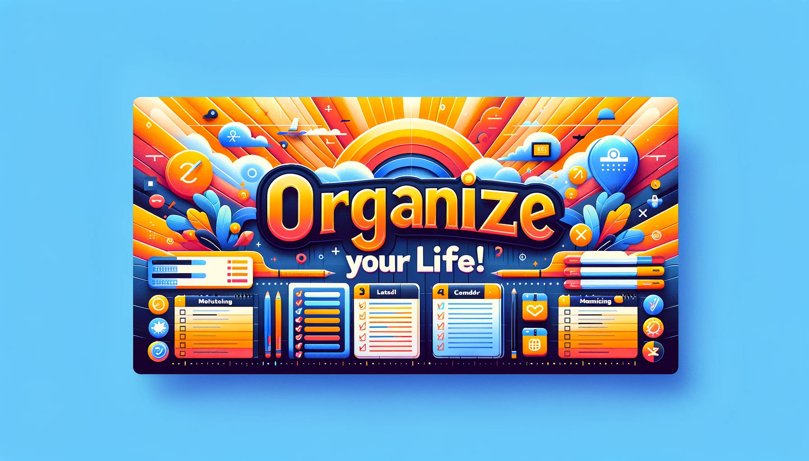

# Yet Another Todo List (YATL) - Part 1



This lab is part one of a two-part case-study. In this first lab, we will create an API for a to-do list in Java. We will use Javalin, a lightweight web framework and SQLite, a simple SQL database engine. We will structure the project using the Model View Controller (MVC) pattern. Furthermore, we will use the Data Access Object (DAO) pattern to interact with the database.

## Learning Objectives

- Create a simple API in Java
- Use SQLite to store data
- Using Maven to manage dependencies
- Understanding the Maven project structure
- Understand the Model View Controller (MVC) architectural pattern
- Understand the DAO pattern to manage database connections

## The Design

### The Database Schema

We are going to keep things simple. We will have a single table in our database.

The schema is as follows:

| column | type    | description                          |
| ------ | ------- | ------------------------------------ |
| id     | INTEGER | Primary key                          |
| title  | TEXT    | The title of the todo item           |
| done   | BOOLEAN | Whether the todo item is done or not |

Example data:

| id  | title           | done  |
| --- | --------------- | ----- |
| 1   | Buy groceries   | false |
| 2   | Do laundry      | true  |
| 3   | Clean the house | false |
| 4   | Mow the lawn    | false |

### The API

A RESTFUL API is an API that follows the principles of REST. REST stands for Representational State Transfer. It is an architectural style for designing networked applications. The idea is that rather than using complex inter-application communication mechanisms, we can use simple HTTP requests.

In our case, we will return JSON from our API. JSON is a lightweight data interchange format. It is easy for humans to read and write. Furthermore, it is easy for machines to parse and generate. Later, a front-end application could consume this API and display the data in a user-friendly way (e.g., a mobile app or a web app).

The JSON format for a todo item is as follows:

```json
{
  "id": 1,
  "title": "Buy groceries",
  "done": false
}
```

A list of todos is represented as an array of todo items:

```json
[
  {
    "id": 1,
    "title": "Buy groceries",
    "done": false
  },
  {
    "id": 2,
    "title": "Do laundry",
    "done": true
  }
]
```

### The Software Architecture


We will use the Model View Controller (MVC) pattern to structure our application. The MVC pattern is a way of separating concerns in an application. It is a way of organising the code so that it is easier to understand and maintain.

## Exercise 1: Setting up the project and our development environment
