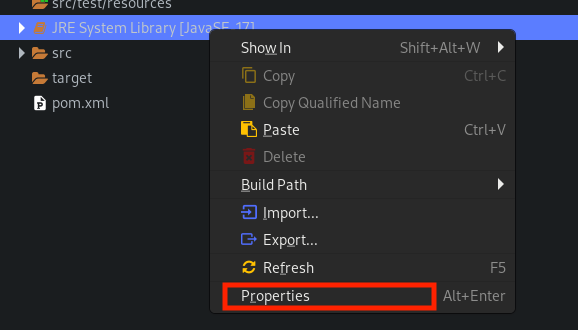
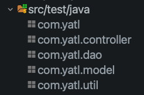

# Yet Another Todo List (YATL) - Part 2


This is the second part of our two part lab series on building the API for YATL. In this part, we will consider how we can write a comprehensive set of tests for our API.

## Learning Objectives

- Understanding how to write unit, feature, and systems tests.
- Working with the Junit and RestAssured libraries.
- Understanding how to mock using Mockito.

## Exercise 1: Setting up the Project

In this section, you will grab the starter code and install some dependencies to support you in testing it.

### Exercise 1.1: Cloning the Repository

1. Open a terminal window.

2. Navigate to the directory where you want the project to be located.

3. Run the following command to clone the repository:

   ```bash
   	git clone https://gitlab.surrey.ac.uk/com_1028_labs/lab-6.git
   ```

The above command will clone the repository into a directory called `lab-6`.

4. Open Eclipse (There are two versions on the lab machines. Open the latest version, 2023 to 06)


5. Import the project folder into your Eclipse Workspace: `File -> Open Projects from File System -> Directory`

6. We need to ensure we are using Java 17, or higher. In your package explorer in the root of your project, you should see a file called `JRE System Library`. Right click on this and select `Properties`. In the `Execution Environment` section, select `JavaSE-17` and click `Apply and Close`.




6. At this stage, you should be able to run the project. Right click on `src/main/java/com/yatl/Main.java` and select `Run As -> Java Application`. In the console, you may see some warnings regarding a logger not being set up, ignore this

7. To test your application is work open Firefox and navigate to `http://localhost:8000/todos`. You should see a JSON response with an empty array.

**TIP: Ensure you use Firefox or Chrome with a JSON extension installed. Otherwise, the API output will be hard to read**

8. Explore the further functionality of the API by using the following endpoints:

   - `http://localhost:8000/todos`
   - `http://localhost:8000/todos/1`
   - `http://localhost:8000/todos/?status=completed`
   - `http://localhost:8000/todos/?status=active`

JSON is a format for storing and transporting data. A front end developer would use this data to display the information to the user. For example, a front end developer could use the data from the `/todos` endpoint to display a list of todos to the user. [You can read more about JSON here](https://developer.mozilla.org/en-US/docs/Learn/JavaScript/Objects/JSON).

### Exercise 1.2: Installing Dependencies

In order to test the YATL application, we are going to need to install three testing libraries:

- junit - JUnit for unit testing
- mockito - Mockito for mocking objects in unit tests
- rest-assured - Testing and validating our APIs

1. See if you can find the above dependencies on the [Maven Repository](https://mvnrepository.com/). When you have found them, add them to the dependencies section of the `pom.xml` file. You should install the latests versions of the dependencies. At the time of writing, these are:

   - junit: 5.10.2
   - mockito-core: 5.11.0
   - rest-assured: 5.4.0

[Check your POM.xml file against the solutions](https://gitlab.surrey.ac.uk/com_1028_labs/lab-6/-/blob/exercise-1-solutions/pom.xml?ref_type=heads)

### Exercise 1.3: Setting up the Test Directory

We are now ready to create some packages for our tests to go in. These packages should be created in the `src/test/java` directory. They should mirror the packages in the `src/main/java` directory.

1. To match the `src/main/java` directory, right click on the `src/test/java` directory and create the following packages:

- `com.yatl`
- `com.yatl.controller`
- `com.yatl.dao`
- `com.yatl.model`
- `com.yatl.util`

When done, your `src/test/java` directory should look like this:



2. Eclipse sometimes hides empty packages. The best way to avoid this is to click on the three dots in the top right of the package explorer and select `Filters and Customization`. Then uncheck `Empty Packages` and click `OK`.

## Exercise 2: Testing the YATL Application

We are now ready to start writing some tests for our application. In this exercise, we will construct unit and wider reaching integration tests.

### Exercise 2.1: Testing the `Todo` Model

Let's consider how we might test `src/main/java/com/yatl/model/Todo.java`. This class is simply a POJO (Plain Old Java Object) that represents a TODO in our application. Some people make the argument that we don't need to test POJOs (I tend to agree with this); however, let's take the purist approach and write a test for it anyway. Since we are isolating a single object, this can be considered a unit test.

1. Create a new class called `TodoTest` in the `com.yatl.model` test package. Add the following skeleton code to the class:

```java
 package com.yatl.model;

import static org.junit.jupiter.api.Assertions.assertEquals;
import org.junit.jupiter.api.BeforeEach;
import org.junit.jupiter.api.Test;

public class TodoTest {

	private Todo todo;

	// this method is called before each test
	// giving us a fresh todo object to work with
	@BeforeEach
	public void setUp() {
		// Create a new todo object
	}

	@Test
	public void testTodoCreated() {
		// Use the getters to assert the todo object was created with the expected values
		// test each of the getters return the values in the todo object created in the
		// setUp method
	}

	@Test
	public void testTodoSetters() {
		// Use the setter to update the todo object and then use the getter to assert
		// the todo object was updated with the expected values
	}
}
```

2. Complete the above test class, and then run the tests. To run the tests, right click on the `TodoTest` class and select `Run As -> JUnit Test`. You should see the tests pass.

[If you got stuck, check your `TodoTest` class against the solutions](https://gitlab.surrey.ac.uk/com_1028_labs/lab-6/-/blob/exercise-2-1-solution/src/test/java/com/yatl/model/TodoTest.java?ref_type=heads)

### Exercise 2.2: Testing the TodoDao with an in-memory database

Let's consider how we might test `src/main/java/com/yatl/dao/TodoDao.java`. This class is responsible for interacting with the database. As such, it becomes interesting to test. We have two options here:

1. We could test the class using and in-memory database.
2. We could mock the database.

In this case, I prefer the first option. Where possible, I would rather use a real database to test. Mocking can be tricky, especially when we are testing SQL statements. Moreover, If we were to mock our database, all we could really test is methods are called with the correct SQL statements. We wouldn't be able to test the SQL statements return the correct data.

1. The first thing we need to do is create a new database for our tests. Create a `TestSeeder` class in the `com.yatl.util` package (ensure it's in your test folder). [Next, copy and past the code from from my solution into your `Seeder` class.](https://gitlab.surrey.ac.uk/com_1028_labs/lab-6/-/blob/exercise-2-2-solutions/src/test/java/com/yatl/util/TestSeeder.java?ref_type=heads)

You should notice the test Seeder class is similar to the Seeder class in the `src/main/java/com/yatl/util` package. The only major difference is we are returning the connection. We do this, as the database will be created in memory and we can't access it via a path. As such, we need to be able to pass the connection around.

1. The next thing we need to do is update `src/main/java/com/yatl/util/Database.java` to allow us to pass a connection to the Database object. This is simple, we just need to overload the constructor and `getInstance` methods. We can do this by adding the following code to the `Database` class:

```java

   private Database(Connection connection) {
   	this.connection = connection;
   }

  public static Database getInstance(Connection conn) {
		instance = new Database(conn);

		return instance;
}

```

We are now ready to test the `TodoDao` class.

2. In `src/test/java/com/yatl/dao` create a class called `TodoDaoTest`.

3. The first thing you need to do is create a `@BeforeEach` method that will run the seeder for each test. You can do this by adding the following code to the `TodoDaoTest` class:

```java

   	TodoDao todoDAO;
	@BeforeEach
	public void setUp() {
		String url = "jdbc:sqlite::memory:";
		TestSeeder seeder = new TestSeeder(url);
		seeder.createTables();
		Database.getInstance(seeder.getConnection());
		todoDAO = new TodoDao();

	}

```

> > Ensure you add the correct imports to the top of the class. You can do this by pressing `Ctrl + Shift + O` in Eclipse.

Above, we are using the test seeder to create a new database in memory. We then pass the connection to the `Database` class. As the Database class is a singleton, the entire application will use our in-memory database. The final thing we do is create a new `TodoDao` object, this is what we will be testing.

4. See if you can write the following tests methods:

- `testGetAllTodos` - This method should test the `getAllTodos` method. You should assert that the list of todos returned is the correct length (4). Don't test the values of each todo, this is overkill. Later we will run integration tests to test the values of the todos.

- `testById` - This method should test the `getTodo` method. You should assert that the todo returned is the correct todo by checking the title. As this point you can test the title of the todo (e.g., Learn Java). Since it's unique, it's a good test.

- `testGetByStatus` - This method should test the `getByStatus` method. For getByStatus(true) the length of the list should be 1 (the number for completed todos). For getByStatus(false) 3, the number of active todos.

**HINT:** Here's an example of how you might test the `getAllTodos` method:

```java
@Test
	public void testGetAllTodos() {
		List<Todo> todos;
		try {
			todos = todoDAO.getAll();
			assertEquals(4, todos.size());
		} catch (SQLException e) {
			fail("SQL Exception");
			e.printStackTrace();
		}

	}
```

[If you got stuck, check the solutions here](https://gitlab.surrey.ac.uk/com_1028_labs/lab-6/-/blob/exercise-2-2-solutions/src/test/java/com/yatl/dao/TodoDaoTest.java?ref_type=heads)

### Exercise 2.3: Testing the Controller Class

Controllers are the glue between our data layer and the view. In our case the view is the API. To trigger the API we'd need to send an HTTP request. However, we don't want to do this, right now. We want to test the controller in isolation. As such, we need to mock the HTTP request. We can do this using the `Mockito` library.

Furthermore, you'll notice we pass a `TodoDao` object to the `TodoController` class. Again, we don't want to test the `TodoDao` class, we want to test the `TodoController` class. As such, we also need to mock the `TodoDao`.

1. Create a new class called `TodoControllerTest` in the `com.yatl.controller` test package.

Let's, first, consider how we might test the `getAllTodos` method on the TodoController. This method is responsible for returning all the todos. It has the following requirements:

- If the status is null, the `getAll` method on the DAO is called.
- If the status is "completed", the `getByStatus` method on the Dao is called with the parameter `true`.
- If the status is "active", the `getByStatus` method on the Dao is called with the parameter `false`.
- If an exception is thrown, the HTTP status is set to 500.

Let's test the first three points.

2. Set up your mocks before each test. You can do this by adding the following code to the `TodoControllerTest` class:

```java
package com.yatl.controller;
import static org.mockito.Mockito.mock;

import org.junit.jupiter.api.BeforeEach;

import com.yatl.dao.TodoDao;

import io.javalin.http.Context;

class TodoControllerTest {

   private Context ctx;
   private  TodoDao todoDao;
   private  TodoController todoController;

   @BeforeEach
   public void setUp() {
   	ctx = mock(Context.class);
   	todoDao = mock(TodoDao.class);
   	todoController = new TodoController(todoDao);
   }

}
```

3. Now, create your test:

```java
@Test
	public void testGetAllTodos() {
		todoController.getAllTodos(ctx);
		try {
			verify(todoDao).getAll();
		} catch (SQLException e) {
			e.printStackTrace();
		}

	}
```

> > Ensure you add the correct imports to the top of the class. You can do this by pressing `Ctrl + Shift + O` in Eclipse.

Above, we are testing when the `getAllMethod` is called, the default behavior it to call the `getAll` method on the `TodoDao` object. Run the test.

**ALERT:** Notice how our test failed with the following message:

```
Wanted 1 time:
-> at com.yatl.dao.TodoDao.getAll(TodoDao.java:25)
But was 2 times:
```

We are calling getAll todos in error at the start of the method. We should change this line to `List<Todo> todos = null`. When you have done this, run the test again. It should pass. This was actually a mistake I made; however, I only spotted it when I ran the test.

Let's now consider how we can test the second two points, get by completed and active todos. To achieve this, we need to stub the return value of the `queryParam` method. We can do this using this technique: `when(ctx.queryParam("status")).thenReturn("completed");`

3. Add the following test to the `TodoControllerTest` class:

```java
@Test
	public void testGetTodosByStatus() {

		try {
			when(ctx.queryParam("status")).thenReturn("completed");
			todoController.getAllTodos(ctx);
			verify(todoDao).getByStatus(true);
			when(ctx.queryParam("status")).thenReturn("active");
			todoController.getAllTodos(ctx);
			verify(todoDao).getByStatus(false);
		} catch (SQLException e) {
			// TODO Auto-generated catch block
			e.printStackTrace();
		}
	}

```

> > Ensure you add the correct imports to the top of the class. You can do this by pressing `Ctrl + Shift + O` in Eclipse.

Above, we are testing that when the status is "completed" the `getByStatus` method is called with the parameter `true`. When the status is "active" the `getByStatus` method is called with the parameter `false`.

4. Now it's your turn! Complete this task by adding the following tests:

- `public void testThrows500WhenGetAllDatabaseError()` - this tests the final point, if an exception is thrown, the status is set to 500. You can stub the `getAll` method to throw an exception like this: `when(todoDao.getAll()).thenThrow(new SQLException());` You can then check the status code like this: `verify(ctx).status(500);`.

- `public void testGetTodoById()` - to create this test stub the value returned from the path param method. You can do this like this: `when(ctx.pathParam("id")).thenReturn("1");`. You should check that the `getTodo` method is called with the parameter 1.

- `public void testThrows500WhenGetByIdDatabaseError()` - similar to the exception test above.

- `public void testThrows404WhenTodoNotFound` - check that the status is set to 404 when the todo is not found. You can do this by stubbing the `getTodo` method to return null.

[If you got stuck, check the solutions here](https://gitlab.surrey.ac.uk/com_1028_labs/lab-6/-/blob/exercise-2-3-solutions/src/test/java/com/yatl/controller/TodoControllerTest.java?ref_type=heads)`

### Exercise 2.4: Pulling everything together with integration tests

We are now ready to pull everything together with integrations tests. These could also be called system tests. We are going to test the entire application, from the controller to the database. We will use the `RestAssured` library to do this.

As integration tests cover the entire application, we are going to create them all in one file that lives in the `com.yatl` test package.

1. Create a new class called `IntegrationTests` in the `com.yatl` test package.

The first thing we need to do is create a test version of our application and seed our in-memory database, just like we did when testing the DAO.

2. At the top of the class, add the following code:

```java

package com.yatl;

// rest assured imports; we will use these to test our API
import static io.restassured.RestAssured.given;
import static org.hamcrest.Matchers.equalTo;
import static org.hamcrest.Matchers.hasItems;


import org.junit.jupiter.api.AfterEach;
import org.junit.jupiter.api.BeforeEach;

import com.yatl.util.Database;
import com.yatl.util.TestSeeder;

import io.javalin.Javalin;

class IntegrationTests {

	Javalin app;
	TestSeeder seeder;

	int port = 6000;

	String baseUrl = "http://localhost:" + port;


	@BeforeEach
	public void setUp() {
		String url = "jdbc:sqlite::memory:";
		seeder = new TestSeeder(url);
		seeder.createTables();
		Database.getInstance(seeder.getConnection());
		app = AppConfig.startServer(port);
	}

	@AfterEach
	public void tearDown() {
		app.stop();
	}
}
```

Above, we are creating a new `TestSeeder` object and creating a new database in-memory. We then pass the connection to the `Database` class. We then start the server on port 6000. We are using the `AppConfig` class to start the server. This is a class that lives in the `com.yatl` package of our application.

We can now use the `RestAssured` library to test our API. This library allows us to send HTTP requests to our API and assert the response. For instance, we can write a test like this:

```java

@Test
   public void testGetAllTodos() {
      given().when().get(baseUrl + "/todos").then().assertThat().statusCode(200);
   }

```

Above, we are sending a `GET` request to the `/todos` endpoint and asserting that the status code is 200. This is a simple test, but it's a good start. We can also take things further and inspect the the records in the response.

```java
@Test
public void testGetAllTodos() {

	given().when().get(baseUrl + "/todos")
			.then()
			.assertThat()
			.statusCode(200)
			.body("id", hasItems(1, 2, 3, 4))
			.body("title", hasItems("Learn Java", "Vote for Joe", "Buy a car", "Ace Joes Module"));

}

```

The above code tests if the expected todos' id and titles are returned in a JSON list - pretty awesome, and close to how a real client application would interact with the API. If the response is not as expected, the test will fail.

We can also test if we can retrieve a single todo:

```java

@Test
	public void testGetTodoById() {
		given().when().get(baseUrl + "/todos/1")
				.then()
				.assertThat()
				.statusCode(200)
				.body("id", equalTo(1))
				.body("title", equalTo("Learn Java"));
	}

```

Notice how we are using the `equalTo` method to test the values of the movie, this is because it is a single item. It will look like this:

```json
{
  "id": 1,
  "title": "Learn Java",
  "completed": false
}
```

1. [Can you use the Rest Assured documentation, and my example above, to write tests for the following requirements](https://github.com/rest-assured/rest-assured/wiki/Usage#example-1---json):

- When I send a GET request to /todos, I should receive a list of todos.
- When I send a GET request to /todos/1, I should receive the todo with the id of 1.
- When I send a GET request to /todos?status=completed, I should receive a list of completed todos.
- When I send a GET request to /todos?status=active, I should receive a list of active todos.
- When I send a request with an invalid id, I should receive a 404 status code.

To get the above tests to work, you'll need to ensure the following imports are at the top of the `IntegrationTests` class:

```java
import static io.restassured.RestAssured.given;
import static org.hamcrest.Matchers.equalTo;
import static org.hamcrest.Matchers.hasItems;
```

[If you got stuck, check the solutions here](https://gitlab.surrey.ac.uk/com_1028_labs/lab-6/-/blob/exercise-2-4-solutions/src/test/java/com/yatl/IntegrationTests.java?ref_type=heads)

**END OF LAB :)**
